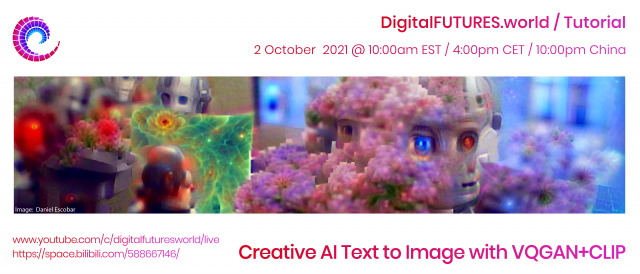

# Creative-AI-Text-to-Image
This is the repository for The **DigitalFUTURES** session: **Creative AI text to image**
Digital FUTURES Technical Tutorials

---
## Tutors: 
### Mayur Mistry, Daniel Escobar
## Guest Speaker: 
### Daniel Russel

#### YouTube Link of the session: https://www.youtube.com/c/DigitalFUTURESworld
#### Presentation Link: https://docs.google.com/presentation/d/1jw2A1QsSElo1Fn0XzEHO_27tUhiQWnnaVRJLSTDuuLI/edit?usp=sharing
---

## Learning Objectives: 
Have an overview of state of the art multimodal AI models for creative exploration 
Gain hands on experience of creating AI artwork using Google Colab 
Provide insights of different AI models that could be integrated in Design workflow

### Software/interface Links:
<ul>
 <li>https://colab.research.google.com/drive/1GFshq_xU01596J-lEZj-nJsIRNlIpXXh?usp=sharing</li>
 <li>https://colab.research.google.com/drive/1dJcFfR7oqWDy_73LJ0ker0OX7ONqjwd-?usp=sharing</li>
 <li>https://colab.research.google.com/drive/1z4lh7Yh8uzYQo6GFaCtw7lHc7Zwrqwx9?usp=sharing</li>
</ul>

### Topic: VQ-GAN_CLIP
<ul>
 <li>https://huggingface.co/spaces/akhaliq/VQGAN_CLIP</li>
 <li>https://colab.research.google.com/drive/1zBporKZalDnXImkHl_sje-dIQ8apZgiu?usp=sharing</li>
 <li>https://colab.research.google.com/drive/1z4lh7Yh8uzYQo6GFaCtw7lHc7Zwrqwx9?usp=sharing</li>
 <li>https://huggingface.co/spaces/akhaliq/VQGAN_CLIP</li>
</ul>

---
### Tutor’s Social Media
https://www.linkedin.com/in/mayurmistry7/
 
https://www.instagram.com/d__o_l_o__p/
 
IG: @draw_you_in insta @d__o_l_o__p
---

### Further Readings
https://github.com/Mistrymm7/AIforArchitects/blob/master/Learning-Resources.md
https://www.youtube.com/playlist?
www.elpodedeladata.com

